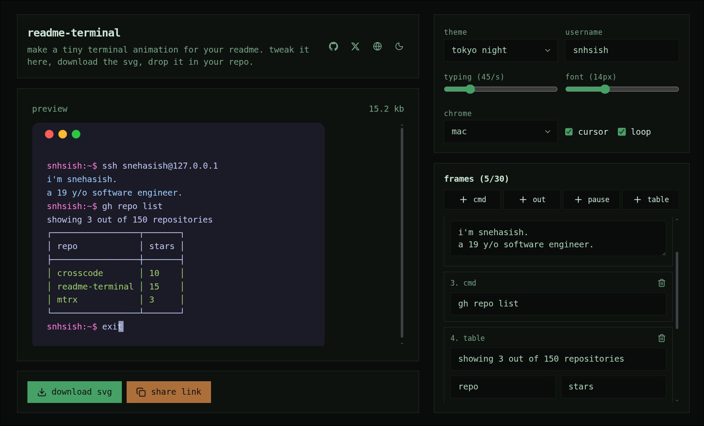

# readme-terminal

Build a tiny animated terminal for your GitHub README. Tweak it in the browser, download the SVG, drop it in your repo.

Live app: **https://terminal-readme.vercel.app**



## How it works

1. Open the app.
2. Add frames (`cmd` / `out` / `pause` / `table`) and adjust theme, font, typing speed, chrome, username.
3. Watch the live preview.
4. Click **download svg** → you get `terminal.svg` (self-contained, SMIL-animated, no JS).
5. Commit `terminal.svg` to your repo and embed it:

```md

```

Use a relative path (`./terminal.svg`) if the SVG lives in the same repo, or a raw URL (`https://raw.githubusercontent.com/<user>/<repo>/main/terminal.svg`) if embedding cross-repo. GitHub renders SMIL `<animate>` / `<set>` animations in README SVGs, so no GIF or video needed.

Tip: enable **loop** if you want the animation to repeat on GitHub. Otherwise it plays once + holds the final frame.

## Features

- 4 frame types: `cmd` (typed with prompt `user:~$`), `out` (instant output, multiline), `pause`, `table` (2-column ASCII box)
- 13 themes (dark + light): tokyonight, dracula, github-dark/light, gruvbox, catppuccin mocha/latte, nord, one dark/light, solarized dark/light
- Settings: typing speed (chars/sec), font size, window chrome (`mac` / `linux` / `none`), cursor, loop, username
- Live preview with file size readout
- `?data=` share links (deflate + base64url, validated with zod) — state also autosaves to `localStorage`
- Static export (`next build`), no backend

## Local development

Requires Node 20+ and [pnpm](https://pnpm.io) (repo pins `pnpm@11.21.0`).

```bash
pnpm install
pnpm dev      # http://localhost:3000
pnpm build    # static export to ./out
pnpm start    # serve production build
pnpm lint     # eslint
```

## Project structure

```text
app/page.tsx          entry, renders <Builder />
components/builder.tsx  all UI state, preview, download, share link
lib/svg.ts            SMIL SVG renderer (layout, timing, escaping)
lib/schema.ts         zod schemas for frames + settings (1–30 frames)
lib/themes.ts         palette definitions
lib/codec.ts          encode/decode ?data= share payloads (fflate)
lib/presets.ts        default demo script
```

### Frame model

| type    | fields | notes |
| ------- | ------ | ----- |
| `cmd`   | `cmd`, `prompt?` | typed char-by-char at `typingSpeed` |
| `out`   | `text` | split on `\n`, appears line-by-line |
| `pause` | `ms` (0–5000) | advances the timeline |
| `table` | `title?`, `headers` ([2 strings]), `rows` (≤20) | rendered as ASCII box, numbers highlighted |

Limits enforced by schema: max 30 frames, command ≤200 chars, output ≤2000 chars, decoded payload ≤8000 chars.

## Contributing

See [CONTRIBUTING.md](./CONTRIBUTING.md).

## License

[MIT](./LICENSE) © snehasishcodes
